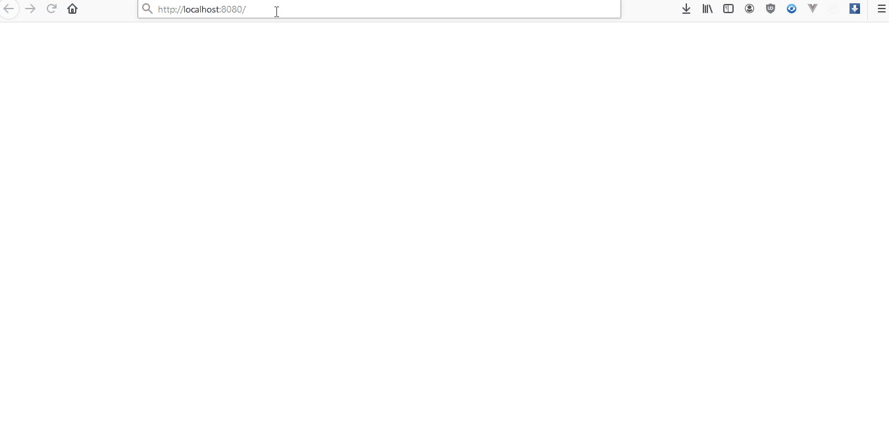

# COVID 19 Stats

A Single Page Application (SPA) made using Vue.js that shows the latest COVID-19 statistics of a country of choice in real-time. 

You can a find a demo <a href="https://vuejs-covid19-stats.herokuapp.com/" target="_blank">here</a>


### GIF Demo



## Project setup
```
npm install
```

### Compiles and hot-reloads for development
```
npm run serve
```

### Compiles and minifies for production
```
npm run build
```

### Run your tests
```
npm run test
```

### Lints and fixes files
```
npm run lint
```

### Customize configuration
See [Configuration Reference](https://cli.vuejs.org/config/).

